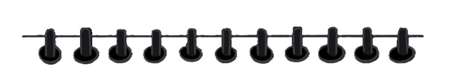

<h1>Hey, what's up?</h1>

My name is Jimena and I'm a Junior Fullstack Developer based in Spain.

###

<h2 align="left">📓 Learning Log & Engineering Diary</h2>

###

This GitHub is my personal playground for technical experimentation. Here, I document my progress, the challenges I’ve tackled, and the journey of building my tech stack. You won’t just find finished code here—you’ll see the footprint of my continuous learning.

✨ Iterating since 2022: Every commit is an improvement, and every bug is a lesson learned.  🚀 Active Learning: Currently focusing on diving deeper into scalable architectures, asynchronous flows, and making the transition toward strictly typed environments.  🎯 Goals: My goal is to bring my analytical mindset and eye for detail to a team that values technical quality and proactive problem-solving, all while embracing new challenges, encouraging growth, and making the workday more fun! 😊

###

<h2 align="left">I code with</h2>

###

  
  
  
  
  
  
  
  
  
  
  
  
  

###

<h2 align="left">Currently learning</h2>

###

          
  
  
  
  
  
  
  
  
  

###

<h3 align="left">Other skills</h3>

###

  
  
  
  
  <!-- 
   -->
  
  
  
  
  
  
  
  
  
  
  
  
  
  
  
  
  
  
  
  
  
  
  
  
  
  
  
  
  

###

<h3 align="left">Design</h3>

###

  
  
  
  
  

###

<h2 align="left">Contact me</h2>

###

  <a href="https://www.linkedin.com/in/majimart/" target="_blank">
     https://www.linkedin.com/in/majimart/</img>
  </a>
   
    JimeMart#8820</img>
   
    majimartinez@gmail.com</img>

###
